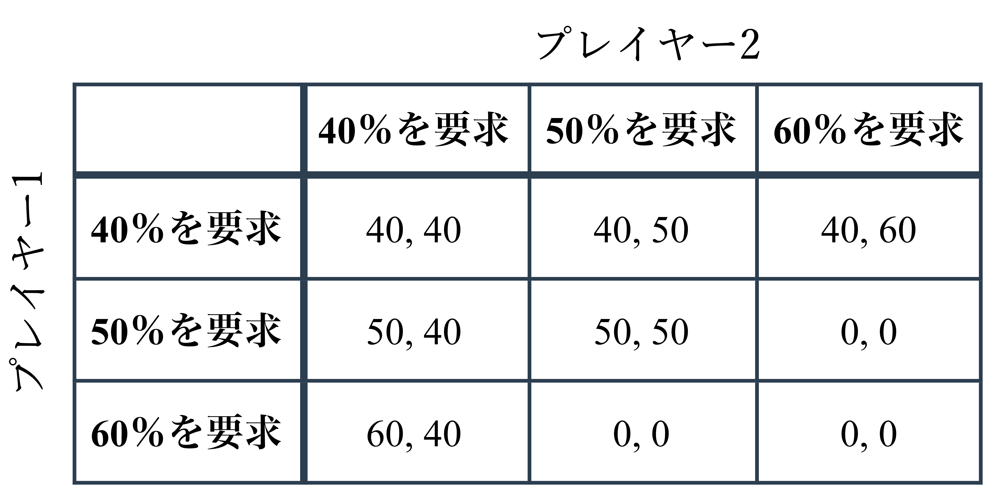
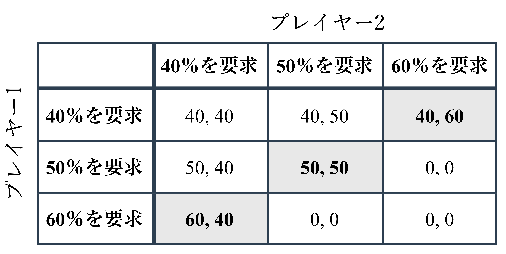

# generate-game-tables

> **開発中** — このリポジトリは現在開発中です。使い方や出力形式は予告なく変わる可能性があります。

2人非同時ゲームの利得行列を `flextable` で組み、`webshot2` でPNG画像として出力するRスクリプトです。Nash均衡のハイライト付きPNGも出力できます。

## 出力例

既定設定 (`GAME SETTINGS`) で生成したサンプルです。

**通常版**



**Nash均衡ハイライト付き**



## Nash均衡のハイライトについて

主目的は利得表の画像生成です。Nash均衡は**純粋戦略**に限り、該当セルを表上でハイライトする補助機能です。混合戦略均衡の計算や、複数均衡がある場合の理論的な整理・説明は行いません。

## 必要なもの

- R (4.x 系を推奨)
- [webshot2](https://cran.r-project.org/package=webshot2) が利用できる **Chrome / Chromium** (初回実行時や `install_chromium()` の案内に従ってください)

## 依存パッケージ

`flextable`, `webshot2`, `magrittr`, `officer`, `grid`, `gridExtra`, `png`

初回実行時はプロンプトに従ってCRANからインストールできます。

## 使い方

リポジトリのルートで:

```sh
Rscript generate_game_tables.R
```

PNGは既定で `output/` に保存されます (`GAME_OUTPUT_DIR` で変更できます)。`output/` 内の PNG は `.gitignore` 対象です。README 用のサンプル画像は `docs/samples/` に置きます (再生成したあと、必要ならここへコピーしてください)。

## カスタマイズ

`generate_game_tables.R` 先頭の **GAME SETTINGS** で、戦略集合・利得行列・プレイヤー表示ラベル・出力先などを編集してください。処理を実行したくない場合は `GAME_ENABLED <- FALSE` にしてください。

## ライセンス

MIT License を [`LICENSE`](LICENSE) に記載しています。
